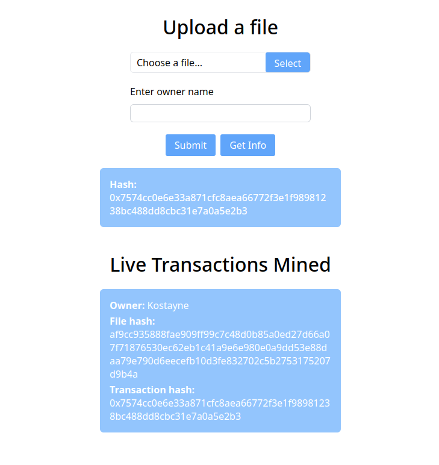

# Proof file own dApp
A simple dApp that can proof file ownership by its hash. 

Provide a file with owner's name to submit an ownership request. 
If the file is already registered the owner name will not be updated.
To get owner name with timestamp just send a file.

Built with [Hardhat](https://hardhat.org), 
[Qwik](https://qwik.builder.io/), [Express](https://expressjs.com/) & [Socket.io](https://socket.io/).

<!-- imgs -->


## Docker
Use docker compose to run client, server & hardhat node.
```
docker compose up
```

## Local development
### Setup environment
Install [Nodejs](https://nodejs.org/en)

### Install dependencies
client sh
```
cd client
npm i
```

server
```sh
cd server
npm i
```

### Scripts
Compile the contract
```
npm run compile
```

Deploy the contract
```
npm run deploy
```

Start server
```
npm run server
```

Start client
```
npm run client
```

Run tests
```
npm run tests
```